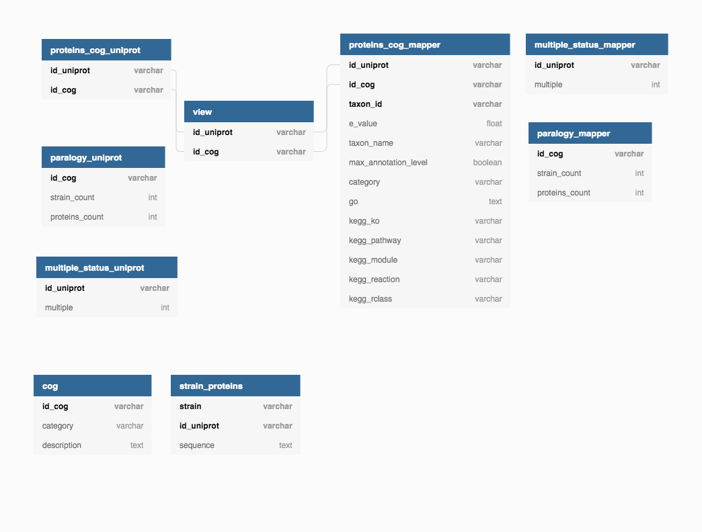

# Installation 

## git clone 
You can retrieve this project with the following command 

```{r, eval = FALSE}
git clone https://gitlab.com/spapais/ptut_helicases.git
```

For this project the following libraries are needed: 
- python >= 3.7
- mysql-connector-python version: 8.0.18
- requests >= 2.25.1

mysql.connector library may require configuration of an environment to solve library dependencies. We encourage to create a conda environment with installation/install.sh 

## install.sh
- Create conda environment 
- Create configurations/congig.py contains username and password of mysql user to connect with

:warning: **USERNAME AND PASSWORD ARE NOT ENCRYPTED AND WILL BE STORED IN CLEAR TEXT. BUT DON'T WORRY, THEY WILL NOT BE ACCESSIBLE FROM GITLAB** :warning:

## mysql.connector

**Known issues :**

mysql-connector-python library does not support caching_sha2_password. You may need to change the encryption of your password from caching_sha2_password to mysql_native_password with the following:

```
ALTER USER 'root'@'localhost' IDENTIFIED WITH mysql_native_password BY 'password';
FLUSH PRIVILEGES;
```

You also may need to lower password policies with :

```
SET GLOBAL validate_password.LENGTH = 4;
SET GLOBAL validate_password.policy = 0;
SET GLOBAL validate_password.mixed_case_count = 0;
SET GLOBAL validate_password.number_count = 0;
SET GLOBAL validate_password.special_char_count = 0;
SET GLOBAL validate_password.check_user_name = 0;
FLUSH PRIVILEGES;
```

answer found [here](https://stackoverflow.com/questions/43094726/your-password-does-not-satisfy-the-current-policy-requirements)

# Arcogs search - analysis/

**DON'T FORGET TO ACTIVATE YOUR CONDA ENVIRONMENT WITH THE FOLLOWING COMMAND**

```{r, eval = FALSE}
conda activate <env_name>
```

## analysis/Cogs_Search_and_Integration.py
Create (or expand) the database  and integrate the results of Cog search in it. 

**This step can be long**

:warning:  Make sure to use --mapper OR --helicase but not both at the same time. :warning: 

```{r, eval = FALSE}
./Cogs_Search_and_Integration.py -b [DATABASE_NAME] -o [HOST_TYPE] -a [COG_DESCRIPTION_FILE] -s [SUFFIX] -m [ANNOTATION_FILE]-f [PROTEINS_FILE]  

  --database, -b : [required] database to connect to
  --host -o : [required] database host
  --arcogs -a : [optional] tsv file with id_cogs descriptions and type from eggnog 
  --suffix -s : [required] the name you want to give to your tables
  --mapper -m : your arcog file from the eggnog mapper
  --helicasefile -f : tsv file with CGBD id associated to uniprot protein id
  --drop -d : [optional] drop all tables with the name given in the argument --suffix
  --name -n : [optional] filename for obsolete uniprot id (default: obsolete)
```
Example of use :  

```{r, eval = FALSE}
./Arcogs_Search_and_Integration.py -b helicase -o localhost -s cgdb16 -f ../data/sf2pfams_archA-sp.tsv -a 
../data/2157_annotations.tsv
```

Obsolete id_uniprot are written in `analysis/results/obsolete.txt`  

**Note :**  
- There is a retry loop if a connection problem occurs with uniprot. 
- Be careful while using drop, as it will delete all the tables which are created under the name of the argument --suffix. 
- If the argument --suffix designate a table that already exists, this table will be updated. 



## analysis/Get_info.py
After database creation, this script gives some basic information.
Use it ith helicasefile argument or mapper argument depending on what file have been used to create tables.

```{r, eval = FALSE}
./Get_info.py.py -b [DATABASE_NAME] -o [HOST_TYPE] -h [HELICASE_FILE] -a [ARCOGS_FILE] -s [TABLE_SUFFIX] -m [MULTIPLE_FILE_NAME] -n [OBSOLETE_FILE_NAME]

  --database -b : [required] database to connect to
  --host -o : [optional] type of database host, localhost by default
  --helicasefile -f : tsv file with CGBD id associated to uniprot protein id
  --mapper -m : your arcog file from the eggnog mapper
  --arcogs -a : [required] tsv file with id_cogs descriptions and type from eggnog 
  --suffix -s : [required] the table you want to test
  --multiple -m : [optional] filename of the outfile, containing multiple status proteins. Use only if you want this multiple outfile.
  --name -n : [optional] filename of obsolete uniprot id (default obsolete.txt).
```

Example of use :

```{r, eval = FALSE}
./Get_info.py -b helicases -o localhost -f data/helicases.tsv -a data/annotations.tsv  -s mapper_results -m multiple_mapper_results -n obsolete_mapper.txt
```

## analysis/Get_file.py
Creates a .tsv file of the precised table (all of them none precised) from the given database.

```{r, eval = FALSE}
./Get_file.py.py -b [DATABASE_NAME] -o [HOST_TYPE] -t [TABLE_NAME]

  --database -b : [required] database to connect to
  --host -o : [optional] type of database host, localhost by default
  --table -t : [optional] name of the table (selects all tables from the database by default) 
```

Example of use :

```{r, eval = FALSE}
./Get_file.py -b helicases -o localhost -proteins_cog_asgard
```

**Note :** The files are available in ../data/tables


# Eggnog Mapper results
## analysis/Get_fasta.py
Create a file in fasta format of desired proteins in analysis/results. You can choose between :
- get all proteins (all)
- get only proteins without arcogs (partial)

```{r, eval = FALSE}
./Get_fasta.py -b [DATABASE_NAME] -o [HOST_TYPE] -... [SELECTIVE PROTEINS]  

  --database -b : [required] database to connect to
  --host -o : [required] host of the database
  --taxon -t : [optional] get proteins from desired taxon
  --suffix -s : [required] suffix of the table to use
  --name -n : [optional] filename (extension in .fa)
  --all -a  : [optional] get all proteins
  --partial -p : [optional] get only proteins without arcogs
```

Example of use :

```{r, eval = FALSE}
./Get_fasta.py -b helicases -o localhost -s asgard -a
```
**Tips for installation and use of eggnog mapper:**

You can install eggnog-mapper by following this [link](https://github.com/eggnogdb/eggnog-mapper/wiki)

Note: You can use the online version of eggnog mapper [here](http://eggnog-mapper.embl.de/) to get your command line. To do so: <br>
-  Submit your request (it doesn't run it without mail confirmation)
-  You will receive an email with the command line at the bottom

**Known issues :**
- copy paste may not work for "-" and "__" 
- You may of issues during execution because of block storage parameter, check the argument `--block_size`.

Command line used in this project : 
```{r, eval = FALSE}
eggnog-mapper/./emapper.py --cpu 4 -i results/eggnog_mapper_file.fa --output arcogs_results.fa --output_dir results/ -m diamond -d none --tax_scope 2157 --go_evidence non-electronic --target_orthologs all --seed_ortholog_evalue 0.001 --seed_ortholog_score 60 --query_cover 20 --subject_cover 0 --override --temp_dir results/temp --block_size 1
```

# Results visualization

## analysis/View.py

Creates a view combining the results of various tables or views

```{r, eval = FALSE}
./View.py -b [DATABASE_NAME] -o [HOST_TYPE] -n [VIEW_NAME] -f [FIRST_TABLE_SUFFIX] -s [SECOND_TABLE_SUFFIX] -p [INT]  

  --database -b : [required] database to connect to
  --host -o : [optional] type of database host, localhost by default
  --name -n : [required] name of the view to create
  --first_suffix -f : [required] suffix of the first table to combine
  --second_suffix -s : [required] suffix of the second table to combine
  --protein_nb -p : [optional] minimal number of protein for a given arcog, 0 by default
```

Example of use :

```{r, eval = FALSE}
./View.py -b elicase -o localhost -n all_results -f cgdb16 -s asgard17
```
# Visualization 
## analysis/Parser_iTOL.py
Creates two files for Arcogs annotation and visualisation :
- NCBI_tree.txt
- iTOL_annotation.txt

Note : This script may take a long time, because of connection issues with uniProt database, but there is a retry loop if a connection problem occurs.

```{r, eval = FALSE}
./Parser_iTOL.py -b [DATABASE_NAME] -o [HOST_TYPE] -s [TABLE_SUFFIX]  

  --database -b : [required] database to connect to
  --host -o : [optional] type of database host, localhost by default
  --suffix -s : [required] suffix of the table to use
  --all -a : [optional] get all proteins, even if there is no COG associated
```

Example of use :

```{r, eval = FALSE}
./Parser_iTOL.py -b helicase -o localhost -s my_view_suffix  
```

## NCBI taxonomic tree maker 
- Open **NCBI_tree.txt** with on [NCBI taxonomic tree maker](https://www.ncbi.nlm.nih.gov/Taxonomy/CommonTree/wwwcmt.cgi)
- select **archaea** in Check groups of interest and [choose]
- select **Include unranked (phylogenetic) taxa**
- select **Expand All**
- Save as phylip tree format

## iTOL
- On [iTOL](https://itol.embl.de/), upload the tree.phy obtained with NCBI taxonomic tree maker 
- Go on **Datasets/Upload** annotation files and select **iTOL_annotation.txt** 
- For more customization choices, go on **Advanced option** on the control panel

Note : Some species may not be recognized by iTOL during annotation integration. This is due to species having different name in uniProt and NCBI databases. If needed, manual changes can be done directly in iTOL_annotation.txt.  
Example : 'Korarchaeum cryptofilum' will become '**Candidatus** Korarchaeum cryptofilum'  

----------------------------------------------------------------------
This project is part of the Master Sc in Bioinformatics of Toulouse (FRANCE)
Authors: Lou Duron, Sandro Papais, Victoria Fathi